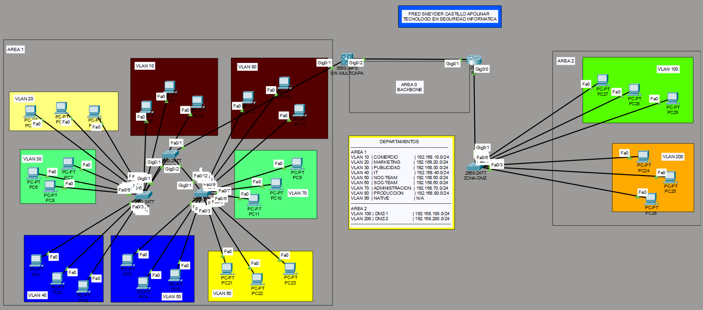

🇬🇧 **English** | 🇪🇸 [Español](README.md)

# 🖧 Multiarea OSPF Campus Infrastructure

---

## Description

This lab simulates a corporate network segmented into **VLANs**, with **multi-area OSPF** routing, a **centralized DHCP server**, and an isolated **DMZ zone** for public services. The topology is designed to demonstrate advanced Cisco networking concepts, such as:

- Inter-VLAN routing using a multilayer switch (Layer 3 Switch).
- OSPF Area 0 (backbone) and Areas 1 and 2.
- Centralized DHCP on router R1.
- Departmental and functional segmentation.
- Trunking and native VLAN.
- DMZ zone with dedicated VLANs for web and cloud servers.

> **Objective:** Serve as study material, practice, or reference for real-world enterprise network implementations.

---

## Topology

- **Router R1** (Cisco 2911): Main gateway, DHCP server, DMZ connection, and OSPF backbone.
- **Multilayer Switch SW-MULTICAPA**: Inter-VLAN routing, OSPF Area 1, trunk to R1.
- **Switch ZONA-DMZ**: Access switch for the DMZ, with VLANs 100 and 200.
- **Access switches** (not configured in this extract): connect hosts from each department.

---

## 📋 VLANs and IP Addressing

| VLAN | Name          | Subnet           | OSPF Area |
|------|---------------|------------------|-----------|
| 10   | Comercio      | 192.168.10.0/24  | 1         |
| 20   | Marketing     | 192.168.20.0/24  | 1         |
| 30   | Publicidad    | 192.168.30.0/24  | 1         |
| 40   | IT            | 192.168.40.0/24  | 1         |
| 50   | NOC-TEAM      | 192.168.50.0/24  | 1         |
| 60   | SOC-TEAM      | 192.168.60.0/24  | 1         |
| 70   | Administración| 192.168.70.0/24  | 1         |
| 80   | Producción    | 192.168.80.0/24  | 1         |
| 99   | NATIVE        | N/A              | –         |
| 100  | DMZ-1 (Web)   | 192.168.100.0/24 | 2         |
| 200  | DMZ-2 (Cloud) | 192.168.200.0/24 | 2         |

**Backbone (Area 0):** `200.10.1.0/24` between R1 and SW-MULTICAPA.

---

## 🔧 Implemented Features

### 🔹 Multi-Area OSPF
- **R1** is an ABR (Area Border Router) between Area 0 and Area 2.
- **SW-MULTICAPA** is an ABR between Area 0 and Area 1.
- All VLANs in Area 1 and Area 2 are injected into OSPF.
- Verification: `show ip ospf neighbor`.

### 🔹 Centralized DHCP
- Router R1 has DHCP pools for each VLAN (10–80 and 100, 200).
- Address exclusions to avoid conflicts (first 9 IPs of each subnet).
- Each SVI on SW-MULTICAPA uses `ip helper-address 200.10.1.1` to forward DHCP requests to R1.

### 🔹 Inter-VLAN Routing
- SVI interfaces on SW-MULTICAPA act as gateways for each department.
- The multilayer switch has `ip routing` enabled.

### 🔹 DMZ Zone
- The ZONA-DMZ switch separates web and cloud servers into VLANs 100 and 200.
- Connection to R1 is a trunk (dot1q) with VLANs 100 and 200.
- The DMZ is in OSPF Area 2, isolated from internal VLANs.

### 🔹 Trunking and Native VLAN
- Link between R1 and ZONA-DMZ: trunk with allowed VLANs 100 and 200, native VLAN 99.
- Link between SW-MULTICAPA and its access switches (not shown in configs) should also use trunk with allowed VLANs and native 99.

---

## 📂 Configuration Files

All devices have their full configurations in the `Configs/` folder. Files include:

- `R1-config.txt`
- `SW-MULTICAPA-config.txt`
- `ZONA-DMZ-config.txt`
- `Switch-Access-XX-config.txt` (if added)

These files can be copied to real devices or imported into Packet Tracer.

---

## How to Use

1. **Download** the `.pkt` file from the `pkt/` folder.
2. **Open** it with Cisco Packet Tracer (version 8.2 or higher recommended).
3. **Verify** configurations using `show` commands (e.g., `show ip route`, `show ip ospf neighbor`).
4. **Test connectivity** between VLANs and toward the DMZ using ping.
5. **Check DHCP assignment** on PCs (they should obtain an IP within their VLAN).

---

## 📸 Screenshots

In the `screenshots/` folder you will find evidence of:

- OSPF routing tables.
- Established OSPF neighbors.
- DHCP pools and leases.
- Active VLANs and assigned ports.

---

## 🧠 Technologies Used

| Technology       | Description                               |
|------------------|-------------------------------------------|
| Cisco Packet Tracer | Network simulation tool                 |
| OSPF             | Link-state routing protocol               |
| VLAN (802.1Q)    | Layer 2 network segmentation              |
| DHCP             | Dynamic IP assignment                     |
| Layer 3 Switching | Inter-VLAN routing                       |
| DMZ              | Demilitarized zone for exposed services   |

---

## 📖 References

- Cisco IOS Configuration Guides
- Packet Tracer Documentation
- OSPF RFC 2328

---

#### 👨‍💻 Author

**Fred Castillo**  
*Technology Student in Information Security*  
*Red Team Aspirant | Offensive Security*

  

---

> **Note:** This lab has been tested on Cisco Packet Tracer 8.2.1. If you find any errors or improvements, feel free to contribute.
