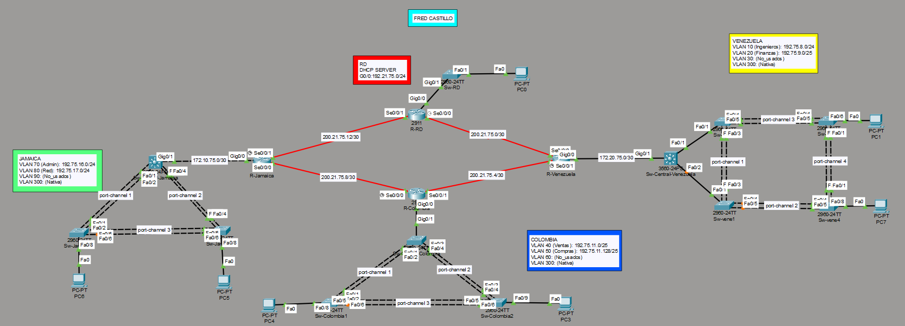
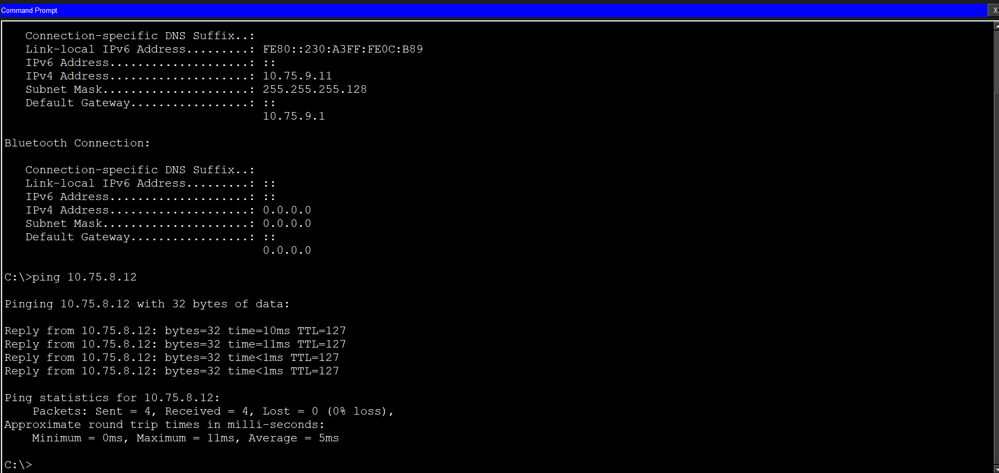
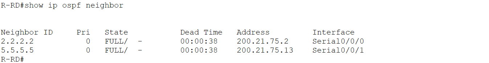
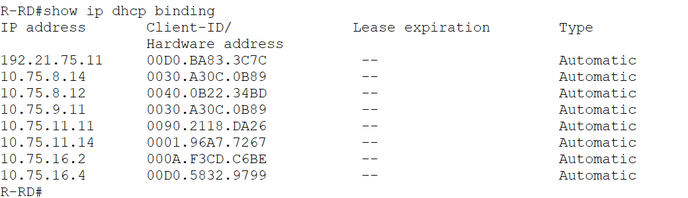
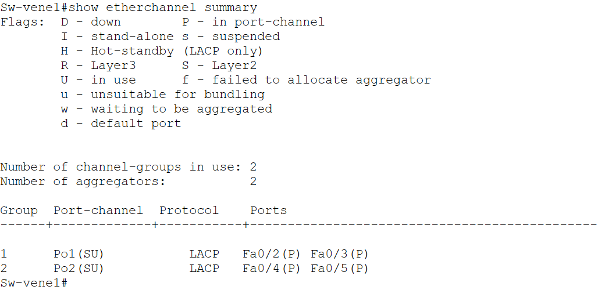
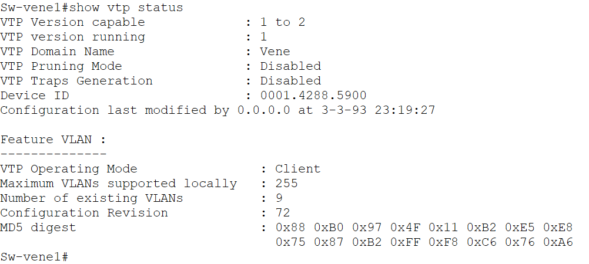
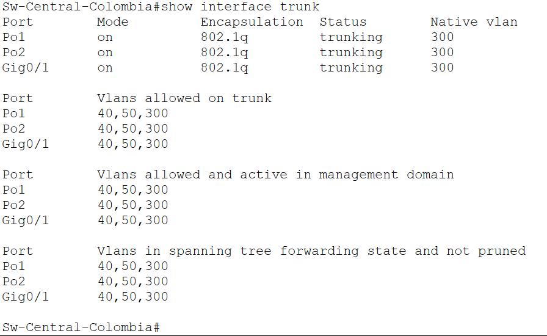
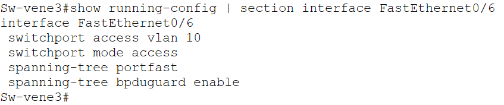

🇪🇸 **Español** | 🇬🇧 [English](README-EN.md)

---

# 📡 Tri-Nation Enterprise Network (OSPF + VLAN + DHCP + LACP)

## 🧾 Descripción

Este proyecto consiste en el diseño e implementación de una red empresarial distribuida en múltiples sedes (República Dominicana, Jamaica, Colombia y Venezuela), simulada en Cisco Packet Tracer.

Se aplican tecnologías y buenas prácticas de redes modernas, incluyendo enrutamiento dinámico, segmentación mediante VLANs, redundancia de enlaces y medidas de seguridad en capa 2.

---

## 🌍 Topología de Red

---

## ⚙️ Tecnologías utilizadas

- OSPF (Enrutamiento dinámico)
- VLANs (Segmentación de red)
- VTP (VLAN Trunking Protocol)
- DHCP Centralizado
- EtherChannel (LACP)
- Router-on-a-Stick (Subinterfaces)
- Spanning Tree Rapid-PVST
- Seguridad en capa 2 (PortFast + BPDU Guard)

---

## 🧠 Características principales

✅ Conectividad completa entre todas las sedes  
✅ Segmentación por departamentos usando VLANs  
✅ Implementación de VLSM para optimización de direcciones IP  
✅ Redundancia con EtherChannel (LACP)  
✅ DHCP centralizado desde República Dominicana  
✅ VLAN de aislamiento para puertos no utilizados (seguridad)  
✅ Uso de VLAN nativa para enlaces trunk  
✅ Convergencia rápida con Spanning Tree (Rapid-PVST)  

---

## 🏢 Estructura de VLANs por país

### 🇻🇪 Venezuela
- VLAN 10: Ingeniería → 10.75.8.0/24 (157 hosts)
- VLAN 20: Finanzas → 10.75.9.0/25 (65 hosts)
- VLAN 30: No_usadas (seguridad)
- VLAN 300: Native

---

### 🇨🇴 Colombia
- VLAN 40: Ventas → 10.75.11.0/25 (100 hosts)
- VLAN 50: Compras → 10.75.11.128/25 (90 hosts)
- VLAN 60: No_usadas (seguridad)
- VLAN 300: Native

---

### 🇯🇲 Jamaica
- VLAN 70: Administración → 10.75.16.0/24 (175 hosts)
- VLAN 80: Red → 10.75.17.0/24 (200 hosts)
- VLAN 90: No_usadas (seguridad)
- VLAN 300: Native

---

## 🇩🇴 República Dominicana (Core de la red)

- Red interna: **192.21.75.0/24**
- Gateway principal: **192.21.75.1**
- Dispositivo: **R-RD**
- Función: DHCP Server para todas las redes y VLANs

---

## 🌐 Enlaces WAN (/30)

| Enlace | Red |
|--------|-----|
| R-RD ↔ R-Venezuela | 200.21.75.0/30 |
| R-Venezuela ↔ R-Colombia | 200.21.75.4/30 |
| R-Colombia ↔ R-Jamaica | 200.21.75.8/30 |
| R-Jamaica ↔ R-RD | 200.21.75.12/30 |

---

## 🔗 Enlaces Router ↔ Switch Capa 3

| Enlace | Red |
|--------|-----|
| R-Jamaica ↔ Sw-Central-Jamaica | 172.10.75.0/30 |
| R-Venezuela ↔ Sw-Central-Venezuela | 172.20.75.0/30 |

---

## 📊 Implementación de VLSM

Se utilizó VLSM (Variable Length Subnet Mask) para asignar subredes en función de la cantidad de hosts requeridos en cada VLAN.

Esto permite:
- Optimizar el uso de direcciones IP  
- Reducir el desperdicio de direcciones  
- Adaptar cada red a sus necesidades reales  

Ejemplo:
- Redes grandes → /24  
- Redes medianas → /25  

---

## 🔧 Configuraciones destacadas

- OSPF (Open Shortest Path First)
- VLANs (Segmentación de red)
- VTP (VLAN Trunking Protocol)
- DHCP Centralizado
- EtherChannel (LACP)
- Router-on-a-Stick (Subinterfaces)
- Spanning Tree Rapid-PVST (spanning-tree mode rapid-pvst)
- Enlaces punto a punto entre switches (spanning-tree link-type point-to-point)
- Seguridad en capa 2 (PortFast + BPDU Guard)

---

## 📸 Validaciones del laboratorio

### 🔁 Conectividad entre VLANs

### 🌐 Vecinos OSPF

### 📡 DHCP Bindings

### 🔗 EtherChannel (LACP)

### 🧠 Estado de VTP

### 🔀 Enlaces Trunk

### 🔒 Seguridad (PortFast + BPDU Guard)

---

## 📁 Estructura del proyecto

Tri-Nation-Enterprise-Network/
┣ pkt/
┃ ┗ tri-nation-network.pkt
┣ configs/
┣ diagrams/
┣ screenshots/
┣ docs/
┣ README.md
┗ README-EN.md

---

## 🚀 Cómo usar este proyecto

1. Abrir el archivo `.pkt` en Cisco Packet Tracer  
2. Revisar configuraciones en la carpeta `/configs`  
3. Validar funcionamiento con comandos como:
   - `ping`
   - `show ip ospf neighbor`
   - `show ip dhcp binding`
   - `show etherchannel summary`
   - `show interface trunk`
   - `show spanning-tree summary`

---

## 🧪 Resultados

✔ Comunicación entre todas las VLANs  
✔ Conectividad entre todas las sedes  
✔ DHCP funcionando correctamente  
✔ Redundancia operativa con LACP  
✔ Convergencia rápida con Rapid-PVST  
✔ Seguridad aplicada en capa 2  

---

#### 👨‍💻 Autor

**Fred Castillo**  
**Estudiante de Tecnólogo en Seguridad Informática**  
*Aspirante a Red Team | Seguridad Ofensiva*

