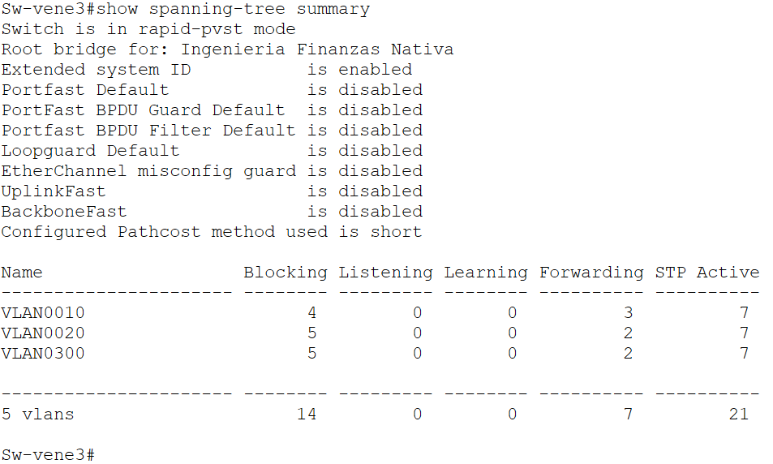
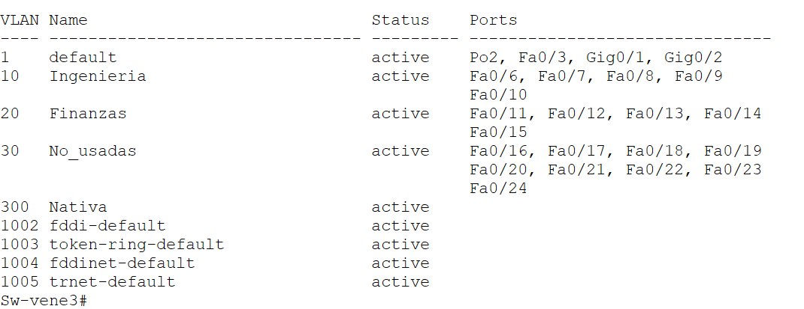

🇪🇸 **Español** | 🇬🇧 [English](README-EN.md)

# 📡 multi-site-enterprise-network (OSPF + VLAN + DHCP + LACP)

<div align="center">
 
[](https://www.cisco.com/)
[](https://www.netacad.com/)
[](https://www.cisco.com/c/en/us/support/ip/open-shortest-path-first-ospf/tsd-products-support-series-home.html)
[](https://www.cisco.com/c/en/us/support/lan-switching/virtual-lan-vlan/tsd-products-support-series-home.html)
[](https://www.cisco.com/c/en/us/tech/lan-switching/etherchannel/index.html)


</div>
   
---

## 🧾 Descripción

Este proyecto consiste en el diseño e implementación de una red empresarial distribuida en cuatro sedes (República Dominicana, Jamaica, Colombia y Venezuela), simulada en **Cisco Packet Tracer 8.2**.

Se aplican tecnologías y buenas prácticas de redes modernas, incluyendo enrutamiento dinámico OSPF, segmentación mediante VLANs, redundancia de enlaces con LACP, DHCP centralizado y medidas de seguridad en capa 2.

---

## ⚙️ Tecnologías utilizadas (configuraciones reales)

- **OSPF** (Área 0 en todos los routers y switches capa 3)
- **VLANs** (Segmentación por departamentos)
- **VTP** (No se usó; las VLANs están configuradas estáticamente)
- **DHCP Centralizado** (R-RD como servidor DHCP para todas las redes)
- **EtherChannel (LACP)** (Redundancia y agregación de enlaces)
- **Router-on-a-Stick** (Subinterfaces en R-Colombia)
- **Rapid-PVST** (Convergencia rápida de Spanning Tree)
- **Seguridad en capa 2** (PortFast + BPDU Guard, interfaces shutdown)

---

## 🧠 Características principales

✅ Conectividad completa entre todas las sedes (topología en anillo con R-RD como núcleo)  
✅ Segmentación por departamentos usando VLANs  
✅ Implementación de **VLSM** para optimización de direcciones IP  
✅ Redundancia con **EtherChannel (LACP)** en switches centrales y de acceso  
✅ **DHCP centralizado** desde República Dominicana (R-RD)  
✅ VLAN de aislamiento (`No_usadas`) para puertos no utilizados  
✅ Uso de VLAN nativa (300) en enlaces trunk  
✅ Convergencia rápida con **Rapid-PVST**  
✅ Interfaces inactivas apagadas (`shutdown`)  
✅ `ip helper-address` para relay DHCP en SVIs  

---

## 🏢 Estructura de VLANs por país

### 🇻🇪 Venezuela (Red base: 10.75.8.0/20)
| VLAN | Nombre       | Red           | Máscara        | Gateway       |
|------|--------------|---------------|----------------|---------------|
| 10   | Ingeniería   | 10.75.8.0     | /24            | 10.75.8.1     |
| 20   | Finanzas     | 10.75.9.0     | /25            | 10.75.9.1     |
| 30   | No_usadas    | -             | -              | -             |
| 300  | Nativa       | -             | -              | -             |

### 🇨🇴 Colombia (Red base: 10.75.11.0/20)
| VLAN | Nombre       | Red           | Máscara        | Gateway         |
|------|--------------|---------------|----------------|-----------------|
| 40   | Ventas       | 10.75.11.0    | /25            | 10.75.11.1      |
| 50   | Compras      | 10.75.11.128  | /25            | 10.75.11.129    |
| 60   | No_usadas    | -             | -              | -               |
| 300  | Nativa       | -             | -              | -               |

### 🇯🇲 Jamaica (Red base: 10.75.16.0/20)
| VLAN | Nombre       | Red           | Máscara        | Gateway       |
|------|--------------|---------------|----------------|---------------|
| 70   | Admin        | 10.75.16.0    | /24            | 10.75.16.1    |
| 80   | Red          | 10.75.17.0    | /24            | 10.75.17.1    |
| 90   | No_usadas    | -             | -              | -             |
| 300  | Nativa       | -             | -              | -             |

---

## 🇩🇴 República Dominicana (Core de la red)

- **Red interna:** `192.21.75.0/24`
- **Gateway principal:** `192.21.75.1` (R-RD)
- **Función:** DHCP Server para todas las redes y VLANs

---

## 🌐 Enlaces WAN (anillo con R-RD como núcleo)

Cada enlace es `/30`. Red base: `200.21.75.0/24`.

| Enlace                          | Red             | IP R1          | IP R2          |
|--------------------------------|-----------------|----------------|----------------|
| R-RD ↔ R-Venezuela             | 200.21.75.0/30  | .1 (R-RD)      | .2 (Venezuela) |
| R-Venezuela ↔ R-Colombia       | 200.21.75.4/30  | .5 (Venezuela) | .6 (Colombia)  |
| R-Colombia ↔ R-Jamaica         | 200.21.75.8/30  | .9 (Colombia)  | .10 (Jamaica)  |
| R-Jamaica ↔ R-RD               | 200.21.75.12/30 | .13 (Jamaica)  | .14 (R-RD)     |

---

## 🔗 Enlaces Router ↔ Switch Capa 3

| País      | Red               | IP Router | IP Switch Central |
|-----------|-------------------|-----------|-------------------|
| Venezuela | 172.20.75.0/30    | .1        | .2                |
| Colombia  | No aplica (router conecta directamente a switch de acceso mediante subinterfaces) | - | - |
| Jamaica   | 172.10.75.0/30    | .1        | .2                |

> **Nota:** En Colombia, el router R-Colombia no tiene un switch central de capa 3; sus subinterfaces (`G0/0.40` y `G0/0.50`) se conectan directamente a un switch de acceso (no mostrado en las configuraciones enviadas). En Venezuela y Jamaica sí existe un switch central con routing habilitado.

---

## 🔧 Fragmentos de configuración reales (extraídos de los dispositivos)

### 📡 DHCP Centralizado en R-RD

```cisco
ip dhcp excluded-address 192.21.75.1 192.21.75.10
ip dhcp excluded-address 10.75.8.1 10.75.8.10
ip dhcp excluded-address 10.75.9.1 10.75.9.10
ip dhcp excluded-address 10.75.11.1 10.75.11.10
ip dhcp excluded-address 10.75.11.129 10.75.11.139

ip dhcp pool VENEZUELA-INGENIERIA
 network 10.75.8.0 255.255.255.0
 default-router 10.75.8.1
 dns-server 8.8.8.8

ip dhcp pool COLOMBIA-VENTAS
 network 10.75.11.0 255.255.255.128
 default-router 10.75.11.1
 dns-server 8.8.8.8

ip dhcp pool JAMAICA-ADMIN
 network 10.75.16.0 255.255.255.0
 default-router 10.75.16.1
 dns-server 8.8.8.8
```

## 🌐 OSPF en R-RD (enlaces seriales)

``` cisco
router ospf 1
 router-id 1.1.1.1
 network 192.21.75.0 0.0.0.255 area 0
 network 200.21.75.0 0.0.0.3 area 0
 network 200.21.75.12 0.0.0.3 area 0
```

🔁 Subinterfaces en R-Colombia (Router-on-a-Stick)

``` cisco
interface GigabitEthernet0/0.40
 description VLAN 40 VENTAS
 encapsulation dot1Q 40
 ip address 10.75.11.1 255.255.255.128
 ip helper-address 200.21.75.1
 ip helper-address 200.21.75.14

interface GigabitEthernet0/0.50
 description VLAN 50 COMPRAS
 encapsulation dot1Q 50
 ip address 10.75.11.129 255.255.255.128
 ip helper-address 200.21.75.1
 ip helper-address 200.21.75.14
```

🔗 LACP en Sw-Central-Venezuela (EtherChannel activo)

```cisco
interface Port-channel1
 switchport trunk native vlan 300
 switchport trunk allowed vlan 10,20,300
 switchport mode trunk
 spanning-tree link-type point-to-point

interface FastEthernet0/2
 channel-protocol lacp
 channel-group 1 mode active
```

🛡️ Seguridad en puertos de acceso (Sw-vene3)

```cisco
interface FastEthernet0/6
 switchport access vlan 10
 spanning-tree portfast
 spanning-tree bpduguard enable
```
📡 IP Helper-Address en Sw-Central-Venezuela

```cisco
interface Vlan10
 ip address 10.75.8.1 255.255.255.0
 ip helper-address 200.21.75.1
```

🌲 Spanning Tree Rapid-PVST y prioridad (Sw-Central-Jamaica)

```cisco
spanning-tree mode rapid-pvst
spanning-tree vlan 1,70,80,300 priority 24576
```

🔍 Verificaciones reales (EtherChannel, trunk, STP)

```cisco
Sw-Central-Venezuela#show interfaces trunk
Port        Mode         Encapsulation  Status        Native vlan
Fa0/1       on           802.1q         trunking      300
Fa0/2       on           802.1q         trunking      300

Sw-vene1#show etherchannel port-channel
Group: 1
Port-channel: Po1    (Primary Aggregator)
Number of ports = 2
Protocol = LACP

Sw-Central-Jamaica#show spanning-tree vlan 70
VLAN0070
  Root ID    Priority    24646
             This bridge is the root
```

## 📸 Validaciones del laboratorio

| Prueba | Captura |
|--------|---------|
| Ping entre VLANs |  |
| Vecinos OSPF |  |
| DHCP Bindings |  |
| EtherChannel Summary |  |
| VTP Status |  |
| Trunk ports |  |
| PortFast + BPDUGuard |  |
| STP rapid |  |
| VLAN Brief |  |

> **Nota:** PortFast y BPDU Guard fueron aplicados manualmente en puertos de acceso”.

## 📁 Estructura del proyecto

```
multi-site-enterprise-network/
├── pkt/
│   └── tri-nation-network.pkt
├── configs/
│   ├── routers/
│   │   ├── R-RD.txt
│   │   ├── R-Venezuela.txt
│   │   ├── R-Colombia.txt
│   │   └── R-Jamaica.txt
│   └── switches/
│       ├── Sw-Central-Venezuela.txt
│       ├── Sw-Central-Colombia.txt
│       ├── Sw-Central-Jamaica.txt
│       ├── Sw-vene1.txt
│       ├── Sw-vene2.txt
│       ├── Sw-vene3.txt
│       └── Sw-vene4.txt
├── diagrams/
│   └── topology.png
├── screenshots/
│   ├── 01_ping_intervlan.png
│   ├── 02_ospf_neighbors.png
│   ├── 03_dhcp_bindings.png
│   ├── 04_etherchannel_summary.png
│   ├── 05_vlan_brief.png
│   ├── 06_trunk_ports.png
│   └── 07_portfast_bpduguard.png
├── docs/
│   └── addressing-table.md
├── README.md
└── README-EN.md
```

## Cómo usar este proyecto

Abrir el archivo .pkt en Cisco Packet Tracer 8.2 o superior.
Revisar las configuraciones completas en la carpeta /configs.

**Validar el funcionamiento con los siguientes comandos:**

ping (entre VLANs y entre países)
show ip ospf neighbor
show ip dhcp binding
show etherchannel summary
show interfaces trunk
show spanning-tree summary

## 🧪 Resultados obtenidos

- Comunicación entre todas las VLANs (inter-VLAN routing)
- Conectividad completa entre todas las sedes (anillo OSPF)
- DHCP centralizado funcionando correctamente
- Redundancia operativa con LACP (EtherChannel)
- Convergencia rápida con Rapid-PVST
- Seguridad aplicada en capa 2 (PortFast + BPDU Guard)
- Interfaces no utilizadas apagadas (shutdown)
- Relay DHCP mediante ip helper-address

#### 👨‍💻 Autor

**Fred Castillo**  
*Estudiante de Tecnólogo en Seguridad Informática*  
*Aspirante a Red Team | Seguridad Ofensiva*

[](https://www.linkedin.com/in/fredcastillo11/)
[](https://github.com/fredcastillo)

